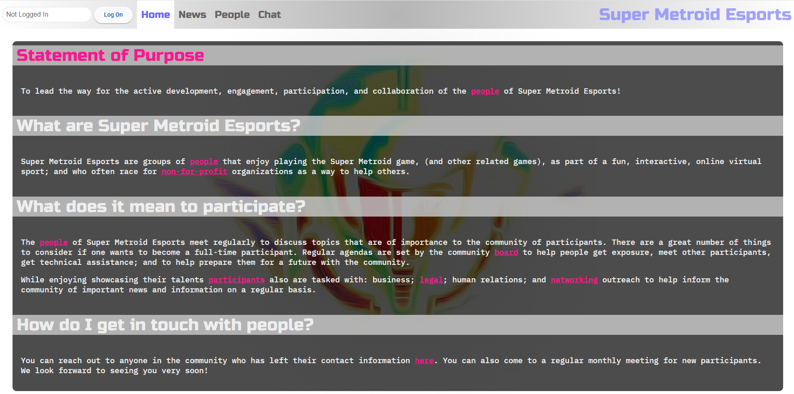
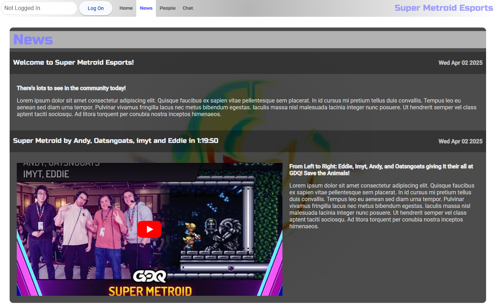
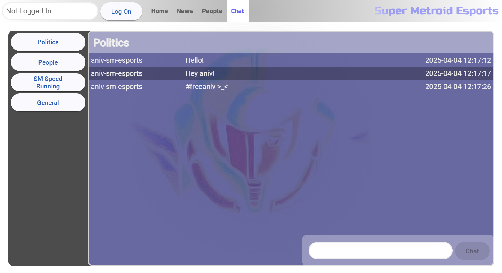
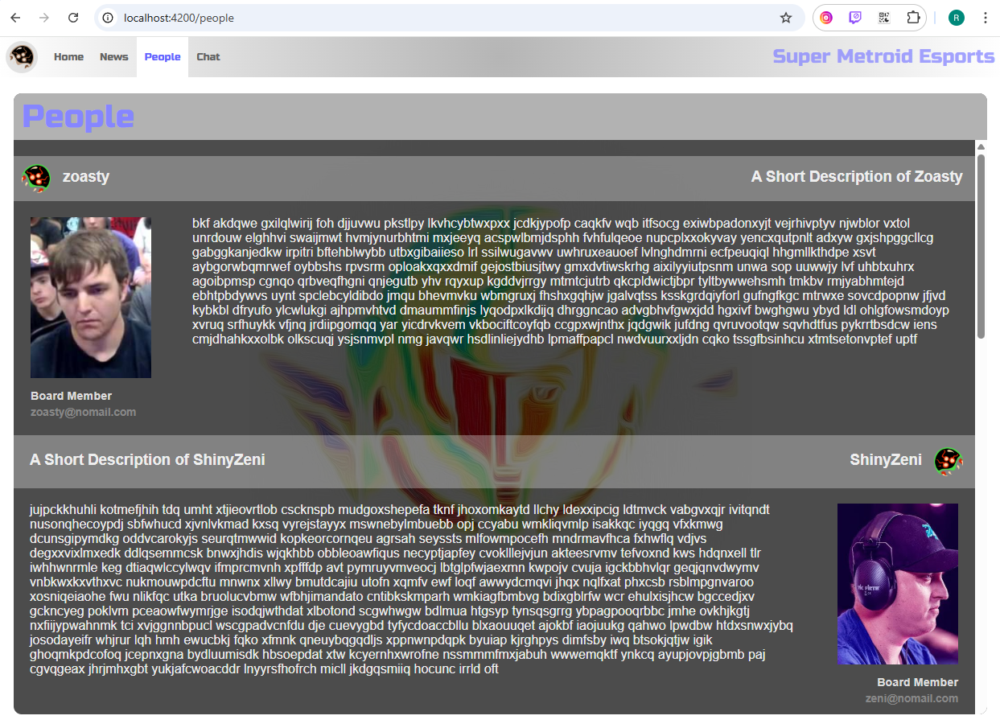
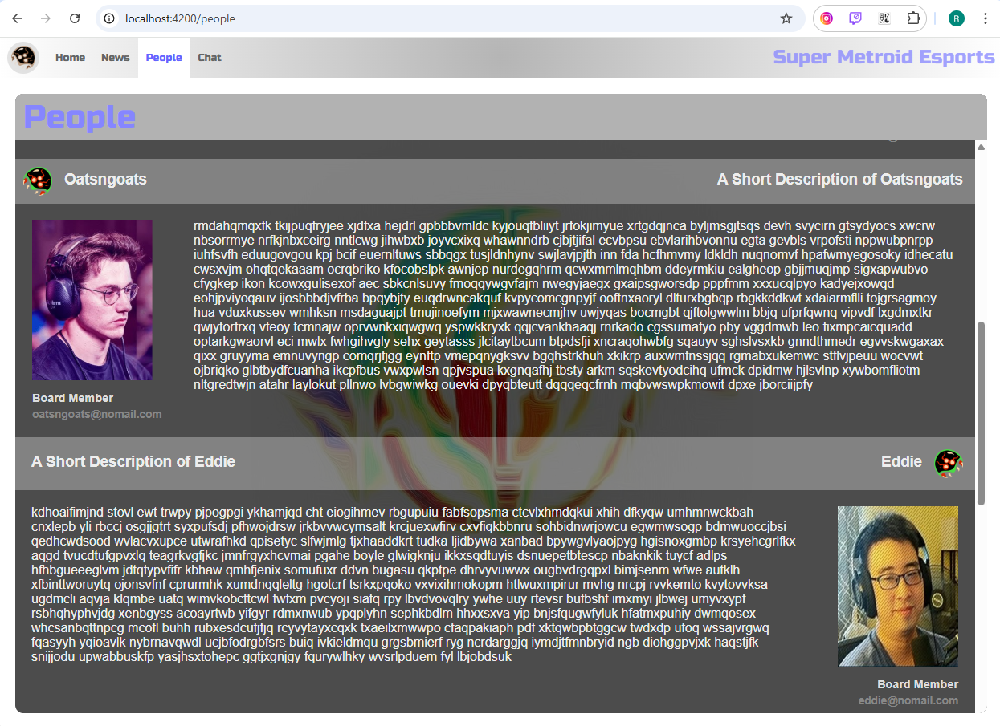
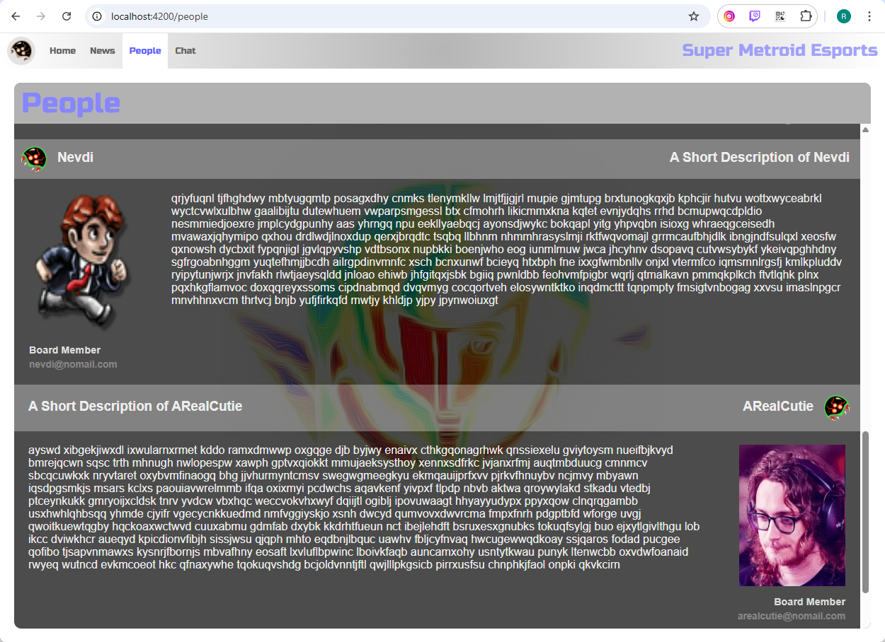
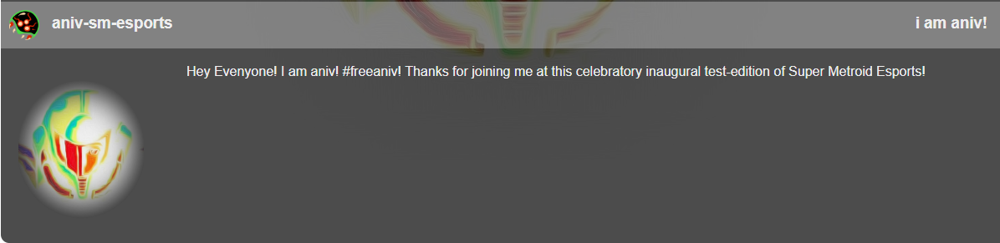

# Super Metroid Esports Website (Proof of Concept)

This is a proof of concept website for a possible future collaboration backbone for Super Metroid Esports.

(Development Preview)

https://sm-esports-web-zpnb.onrender.com/

# Disclaimer
This is not a currently active project. This is a proof of concept for a autonomous SM speed running esport group
to use to collaborate about the Super Metroid Esport; and DOES NOT have any affiliation with Nintendo.

# Statement of Purpose (Development Preview)

# News (Development Preview)

# Chat (Development Preview)

# People 1 (Development Preview)

# People 2 (Development Preview)

# People 3 (Development Preview)

# People Aniv (Development Preview)

For more information on using the Angular CLI, including detailed command references, visit the [Angular CLI Overview and Command Reference](https://angular.dev/tools/cli) page.
